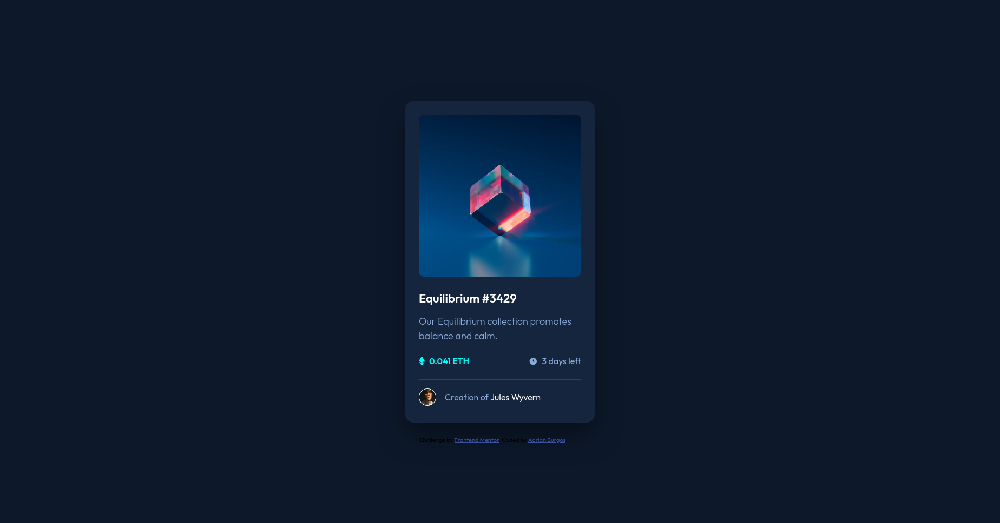

# Frontend Mentor - NFT preview card component solution

This is a solution to the [NFT preview card component challenge on Frontend Mentor](https://www.frontendmentor.io/challenges/nft-preview-card-component-SbdUL_w0U). Frontend Mentor challenges help you improve your coding skills by building realistic projects. 

## Table of contents

- [Overview](#overview)
  - [The challenge](#the-challenge)
  - [Screenshot](#screenshot)
  - [Links](#links)
- [My process](#my-process)
  - [Built with](#built-with)
  - [What I learned](#what-i-learned)
  - [Continued development](#continued-development)
  - [Useful resources](#useful-resources)
- [Author](#author)
- [Acknowledgments](#acknowledgments)

## Overview

### The challenge

Users should be able to:

- View the optimal layout depending on their device's screen size
- See hover states for interactive elements

### Screenshot

### Links

- Solution URL: [Add solution URL here](https://github.com/adrianburgoscolas/nft-preview-card-component)
- Live Site URL: [Add live site URL here](https://adrianburgoscolas.github.io/nft-preview-card-component/)

## My process

### Built with

- Semantic HTML5 markup
- CSS custom properties
- Flexbox
- CSS Grid
- Mobile-first workflow

### What I learned

In this project I was be able to level up my skill using a Mobile-first workflow and practicing Semantic HTML5 markup and styling whit plain CSS also improving coding accessible web pages and web components.

### Continued development

Need to keep improving Semantic HTML5 and accessibility.

### Useful resources

- [Example resource 1](https://www.freecodecamp.org/learn) - This were my first lesson about frontend debelopment I think is a good begining.

## Author

- freeCodeCamp - [Add your name here](https://www.freecodecamp.org/fcce3ec214d-b0f9-4ddc-b526-34aea3d1e4a3)
- Frontend Mentor - [@yourusername](https://www.frontendmentor.io/profile/adrianburgoscolas)
- Linkedin - [@yourusername](https://www.linkedin.com/in/adrian-burgos-1776a6144/)

**Note: Delete this note and add/remove/edit lines above based on what links you'd like to share.**

## Acknowledgments

This is where you can give a hat tip to anyone who helped you out on this project. Perhaps you worked in a team or got some inspiration from someone else's solution. This is the perfect place to give them some credit.

**Note: Delete this note and edit this section's content as necessary. If you completed this challenge by yourself, feel free to delete this section entirely.**
